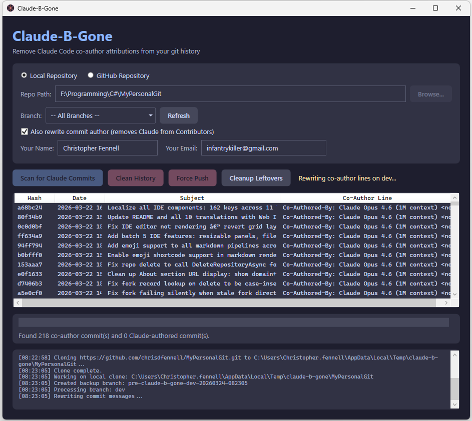

# Claude-B-Gone

**Scrub AI co-author fingerprints from your git history.**

[](https://dotnet.microsoft.com/)
[](https://learn.microsoft.com/en-us/dotnet/desktop/wpf/)
[](LICENSE)
[](https://www.microsoft.com/windows)

---

## What It Does

Claude-B-Gone is a Windows desktop tool that finds and removes `Co-Authored-By: Claude` lines from git commit messages and optionally rewrites commit authorship to remove Claude from GitHub's Contributors list. It rewrites your repository history so that AI co-author attributions inserted by tools like Claude Code are cleanly stripped out.

It works on local repositories and can also scan remote GitHub repositories via the GitHub API.

## Why

When using AI coding assistants like Claude Code, every commit automatically includes a co-author trailer such as:

```
Co-Authored-By: Claude Opus 4.6 (1M context) <noreply@anthropic.com>
```

Some developers prefer a clean commit history without these attribution lines visible to the public. Claude-B-Gone makes it easy to remove them in bulk rather than manually editing each commit.

## Screenshots



## Features

- **Two operating modes** -- Local Repository and GitHub Repository scanning
- **Dark-themed WPF interface** using the [Catppuccin Mocha](https://github.com/catppuccin/catppuccin) color palette
- **Branch auto-detection** -- dropdown auto-populates with all branches, with an "All Branches" option to scan/clean everything at once
- **Scan commits** for Claude co-author attributions across single or all branches
- **Preview affected commits** in a sortable list before making any changes (hash, date, subject, co-author line)
- **Rewrite git history** to remove co-author lines using `git filter-branch`
- **Author/committer rewrite** -- optionally rewrite commits authored by Claude to your own identity, removing Claude from GitHub's Contributors list (uses `git-filter-repo` with mailmap when available, falls back to `git filter-branch --env-filter`)
- **Automatic backup branch creation** before any destructive operation (named `pre-claude-b-gone-<branch>-<timestamp>`, kept local only -- never pushed to remote)
- **Network drive detection** -- repos on network/NAS drives with 50+ commits are automatically cloned to a local temp directory for speed, then pushed back
- **Clone, Clean & Push flow** -- for GitHub mode, clones a remote repo to temp, cleans it, pushes, and offers to delete the temp clone
- **Real-time progress bar** -- streams `git filter-branch` output character-by-character to show live `Rewriting... 42/217 (19%)` progress
- **Real-time log output** with timestamps in the bottom panel
- **GitHub API integration** via [Octokit](https://github.com/octokit/octokit.net) for remote repository scanning
- **Automatic cleanup** after force push -- removes `.git-rewrite`, `refs/original`, backup branches, and runs `git gc`
- **Manual cleanup button** -- "Cleanup Leftovers" button to remove filter-branch artifacts on demand
- **Dirty working tree protection** -- refuses to rewrite history if uncommitted changes are detected
- **Confirmation dialogs** before every destructive operation
- **Single-file EXE** -- publishes as a self-contained single executable (~135MB, no .NET install required)
- **Custom app icon** -- Claude sunburst with a red X prohibition sign

## Prerequisites

| Requirement | Details |
|---|---|
| **.NET 10 SDK** | Target framework is `net10.0-windows`. Download from [dotnet.microsoft.com](https://dotnet.microsoft.com/download). Only needed for building from source. |
| **Git** | Must be on your PATH. The tool shells out to `git` for all repository operations. |
| **Windows** | WPF is Windows-only. No cross-platform support. |
| **git-filter-repo** _(optional)_ | Install via `pip install git-filter-repo`. Used for faster author/committer rewriting via mailmap. Falls back to `git filter-branch --env-filter` if not available. |
| **GitHub Token** _(optional)_ | A [personal access token](https://github.com/settings/tokens) with `repo` scope. Only needed for GitHub mode. Without one, you are limited by the unauthenticated API rate limit (60 requests/hour). |

## Installation

### From source

```bash
git clone https://github.com/your-username/claude-b-gone.git
cd claude-b-gone
dotnet build
```

To run:

```bash
dotnet run --project ClaudeBGone
```

### Publish as single-file EXE

```bash
dotnet publish ClaudeBGone -c Release
```

The self-contained single-file EXE will be in `ClaudeBGone/bin/Release/net10.0-windows/win-x64/publish/`. Copy `ClaudeBGone.exe` anywhere and run it -- no .NET installation required on the target machine.

**Important:** The EXE must be on a local drive (not a network share). Windows blocks executing programs directly from network locations.

## Usage

### Local Repository Mode

1. Launch the application.
2. Select **Local Repository** (the default mode).
3. Enter the path to your git repository, or click **Browse...** to pick the folder.
4. Select a branch from the dropdown, or choose **"-- All Branches --"** to process every branch. Click **Refresh** to reload branches.
5. Click **Scan for Claude Commits**.
6. Review the list of commits that contain Claude co-author attributions.
7. **Optional**: Check **"Also rewrite commit author"** to replace Claude's authorship with your own name/email. Enter your name and email in the fields that appear. This removes Claude from GitHub's Contributors list.
8. Click **Clean History** to rewrite the commit messages. A backup branch is created automatically (local only).
9. After cleaning, click **Force Push** to push the rewritten history to your remote.
10. The app automatically cleans up filter-branch leftovers after a successful push.

### GitHub Repository Mode

1. Select **GitHub Repository**.
2. Enter the repository in `owner/repo` format (e.g. `octocat/hello-world`).
3. Optionally enter a GitHub personal access token to increase API rate limits.
4. Click **Scan for Claude Commits**.
5. Review the results. GitHub mode is **read-only** -- it identifies affected commits but cannot rewrite remote history directly.
6. Click **Clone, Clean & Push** to automatically clone the repo to a temp folder, rewrite history, force push, and clean up.

### Clone, Clean & Push

This is the recommended workflow for GitHub repositories:

1. Scan the repo in GitHub mode to confirm Claude commits exist.
2. Click **Clone, Clean & Push**. The tool will:
   - Clone the repo to `%TEMP%\claude-b-gone\<repo-name>`
   - Create a backup branch
   - Rewrite commit messages to remove co-author lines
   - Optionally rewrite commit authors (if checkbox is checked)
   - Confirm before force pushing
   - Offer to delete the temp clone when finished

### Network Drive Repos

If your repo is on a network/NAS drive (e.g. a mapped drive like `F:\` pointing to `\\server\share`):

- **Small repos (< 50 commits)**: Rewritten directly on the network drive.
- **Large repos (50+ commits)**: Automatically cloned to a local temp directory for speed, rewritten there, then force-pushed back to origin.

## How It Works

### Detection

The tool uses a compiled .NET source-generated regex to match co-author trailer lines:

```
^\s*[Cc]o-[Aa]uthored-[Bb]y:\s*Claude.*<.*@anthropic\.com>.*$
```

This pattern is case-flexible on the `Co-Authored-By` prefix and matches any line where:
- The author name starts with `Claude` (covers Claude, Claude Opus, Claude Sonnet, etc.)
- The email domain is `anthropic.com`

For author detection, it also scans `git log` for commits where:
- The author email contains `anthropic.com`
- The author name contains `claude` (case-insensitive)

### Local Scanning

Commits are retrieved via `git log` with a custom format delimiter. Each commit's full message body is checked against the regex. Matching commits are displayed in the UI. When "All Branches" is selected, each branch is scanned individually and results are deduplicated by commit hash.

### History Rewriting

The tool invokes `git filter-branch --force --msg-filter` with a `sed` command to strip matching lines:

```bash
FILTER_BRANCH_SQUELCH_WARNING=1 \
git filter-branch --force --msg-filter \
  "sed '/^[[:space:]]*[Cc]o-[Aa]uthored-[Bb]y:.*Claude.*@anthropic\.com/d'" \
  -- <branch>
```

This processes every commit on the branch and removes matching lines from commit messages. The `FILTER_BRANCH_SQUELCH_WARNING` env var suppresses the deprecation warning.

### Author/Committer Rewriting

When the **"Also rewrite commit author"** option is checked, the tool uses one of two approaches:

1. **git-filter-repo with mailmap** (preferred, if installed): Creates a temporary mailmap file mapping Claude's identity to yours, then runs `git-filter-repo --mailmap`. After completion, the `origin` remote is automatically restored (filter-repo removes it by default).

2. **git filter-branch --env-filter** (fallback): Runs a shell script that replaces `GIT_AUTHOR_NAME`, `GIT_AUTHOR_EMAIL`, `GIT_COMMITTER_NAME`, and `GIT_COMMITTER_EMAIL` on matching commits.

Both approaches replace commits where:
- The author/committer email is `noreply@anthropic.com`
- The author/committer name contains "claude" (case-insensitive)

This removes Claude from GitHub's **Contributors** widget, which is derived from commit authorship -- not from co-author trailer lines.

### Force Push

After rewriting, the cleaned history is pushed with:

```bash
git push --force origin <branch>
```

`--force` is used instead of `--force-with-lease` because after a history rewrite, the local tracking refs are always stale and `--force-with-lease` would reject every push. Safety is provided by the backup branch created before rewriting.

### Progress Reporting

The app streams `git filter-branch` stderr output character-by-character (not line-by-line) because filter-branch uses `\r` (carriage return) to overwrite progress lines in-place. The progress bar parses `Rewrite abc123 (42/217)` patterns and updates in real-time via direct `Dispatcher.Invoke` calls for immediate UI updates.

## Co-Author Patterns Matched

The following co-author lines are detected and removed:

```
Co-Authored-By: Claude <noreply@anthropic.com>
Co-authored-by: Claude Opus 4.6 (1M context) <noreply@anthropic.com>
Co-Authored-By: Claude Sonnet 4 <noreply@anthropic.com>
co-authored-by: Claude <claude@anthropic.com>
  Co-Authored-By: Claude Haiku <support@anthropic.com>
```

Any line matching the general pattern `Co-Authored-By: Claude...<...@anthropic.com>` will be removed regardless of:
- Capitalization of `Co-Authored-By`
- Specific Claude model name or version
- Specific `@anthropic.com` email address
- Leading whitespace

## Safety Features

| Feature | Description |
|---|---|
| **Backup branches** | Before any rewrite, a branch named `pre-claude-b-gone-<branch>-<YYYYMMDD-HHmmss>` is created locally. Backup branches are never pushed to the remote and are automatically skipped during "All Branches" operations. |
| **Dirty tree check** | The tool refuses to rewrite history if there are uncommitted changes in the working directory. You must commit or stash first. |
| **Confirmation dialogs** | Clean History, Force Push, and Clone/Clean/Push all require explicit user confirmation through dialog boxes. |
| **Read-only GitHub mode** | Scanning via GitHub API never modifies anything. It only reads commit data. |
| **Automatic cleanup** | After a successful force push, the tool automatically removes `.git-rewrite` directories, `refs/original` backup refs, backup branches, and runs `git gc` to reclaim space. |
| **Process timeouts** | Git commands have timeouts (30 minutes for rewrites, 2 minutes for pushes) to prevent the app from hanging indefinitely. |

## Configuration

### GitHub Token

To scan GitHub repositories with higher rate limits:

1. Go to [GitHub Settings > Developer settings > Personal access tokens](https://github.com/settings/tokens).
2. Create a token with `repo` scope (or `public_repo` for public repositories only).
3. Paste the token into the **Token** field in GitHub Repository mode.

The token is not stored anywhere -- it is only held in memory for the current session.

### Branch Selection

- **Local mode**: Use the dropdown to select a specific branch or "All Branches". Click **Refresh** to reload the branch list. The current branch is pre-selected.
- **GitHub mode**: Branch selection applies to the Clone, Clean & Push flow. Leave on the default to use the repo's default branch.

### git-filter-repo

For faster author/committer rewriting, install `git-filter-repo`:

```bash
pip install git-filter-repo
```

The tool automatically detects it in common Python script locations. If not found, it falls back to `git filter-branch --env-filter`.

## Troubleshooting

### "Not a valid git repository"
Make sure the path you entered points to the root of a git repository (the directory containing the `.git` folder).

### "git filter-branch failed"
- Ensure `git` is installed and on your PATH.
- Make sure the working tree is clean (no uncommitted changes).
- On Windows, `git filter-branch` requires the `sed` command, which is bundled with Git for Windows. If you installed git without the Unix tools, this may fail.

### "Rate limited by GitHub API"
Provide a personal access token to increase the rate limit from 60 to 5,000 requests per hour.

### "Access to the path is denied" when cleaning temp directories
Previous runs may have left behind read-only git objects. The app handles this automatically by clearing read-only file attributes before deletion. If the issue persists, manually delete `%TEMP%\claude-b-gone\`.

### Network drive errors / timeouts
Repos on network drives (NAS, mapped drives) are much slower for git operations. The app automatically clones large repos (50+ commits) to a local temp directory. For smaller repos, operations run directly on the network drive.

### Windows blocks the EXE
If the EXE is on a network share, Windows will block execution. Copy `ClaudeBGone.exe` to a local drive (e.g. `C:\ClaudeBGone\`).

### Backup branch pushed to remote
The app now skips `pre-claude-b-gone-*` branches during "All Branches" push operations. If a backup branch was previously pushed, delete it with: `git push origin --delete <backup-branch-name>`

### Contributors still showing on GitHub after cleaning
GitHub caches the Contributors widget. It can take several hours to a full day to update after force-pushing cleaned history. Verify the remote is clean by cloning fresh and checking `git log`.

## Contributing

Contributions are welcome. To get started:

1. Fork the repository.
2. Create a feature branch: `git checkout -b my-feature`.
3. Make your changes and test them.
4. Submit a pull request with a clear description of what you changed and why.

Areas where contributions would be especially useful:
- Cross-platform support (Avalonia or MAUI)
- Support for other AI co-author patterns (GitHub Copilot, Cursor, etc.)
- Unit tests for `CommitMessageCleaner`
- CI/CD pipeline
- Batch mode / CLI interface for automation

## License

This project is licensed under the MIT License. See [LICENSE](LICENSE) for details.

## Disclaimer

**This tool rewrites git history.** Rewriting history is a destructive operation that changes commit hashes. Be aware of the following:

- **Force pushing** overwrites the remote branch. All collaborators will need to re-sync their local copies (e.g., `git fetch && git reset --hard origin/<branch>`).
- **Backup branches are local only.** They are not pushed to the remote. If you delete the local repository, the backups are gone.
- **CI/CD pipelines** that reference specific commit SHAs may break after a history rewrite.
- **Signed commits** will lose their signatures after rewriting.
- **GitHub Contributors cache** may take hours to update after pushing cleaned history.
- **Use at your own risk.** Always verify the results before force pushing, and make sure all collaborators are informed.

This tool is not affiliated with Anthropic.
